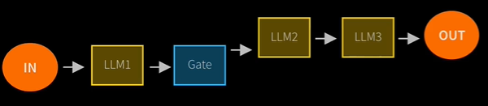
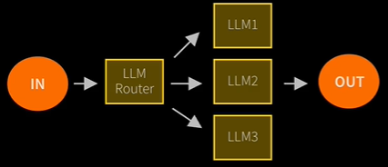
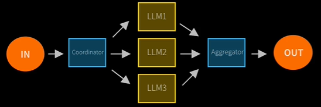
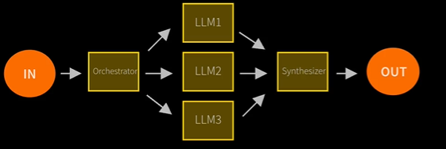
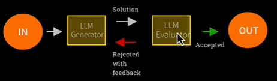
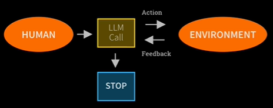
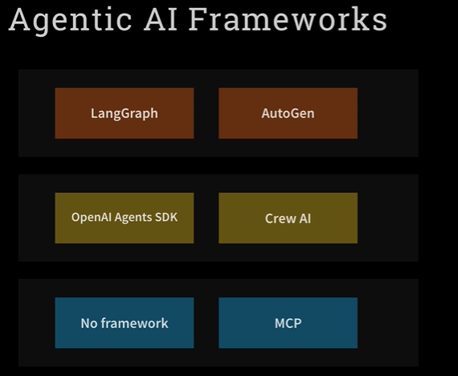

From HuggingFace: AI Agents are programs where LLM outputs control the workflow

1. Multiple LLM calls
2. LLMs with ability to call Tools
3. An environment where LLMs interact
4. A planner to coordinate activities
5. Autonomy

Agentic Systems by Anthropic:
1. Workflows are systems where LLMs and tools are orchestrated through predefined code paths
2. Agents are systems where LLMs dynamically direct their own processes and tool usage, maintaining control over how they accomplish tasks

5 workflow design patterns:
1. Prompt chaining - decompose into fixed sub-tasks, chaining a series of LLM calls

2. Routing - Based on input decide on which LLM to call (separation of concerns)

3. Parallelization - Breaking down tasks and running multiple tasks concurrently. The coordinator and aggregator is our code.

4. Orchestrator workflows - complex tasks are broken down and results aggregated. Similar to 3 but here an LLM does the job of coordinator and aggregator

5. Evaluator-Optimizer - LLM output is validated by another LLM

By contrast, Agents:
1. Open-ended
2. Feedback loops
3. No fixed path

Risks of Agent Frameworks:
1. Unpredictable path
2. Unpredictable output
3. Unpredictable costs

Monitoring is the key
Guardrails ensure your agents behave safely, consistently, and within your intended boundaries

Definition of Agentic workflows: An agent run tools in a loop to achieve a goal (in 2026)
